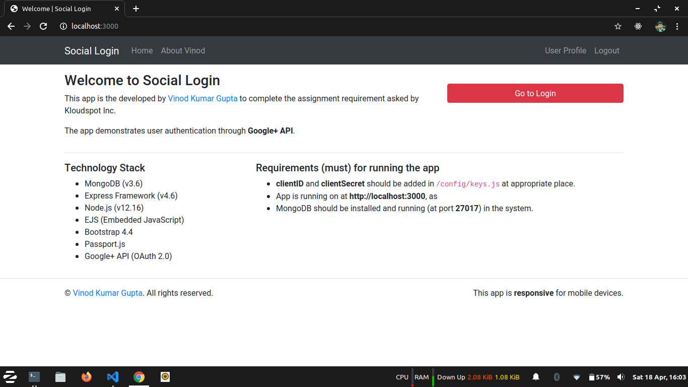
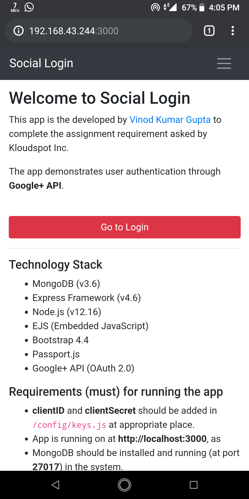
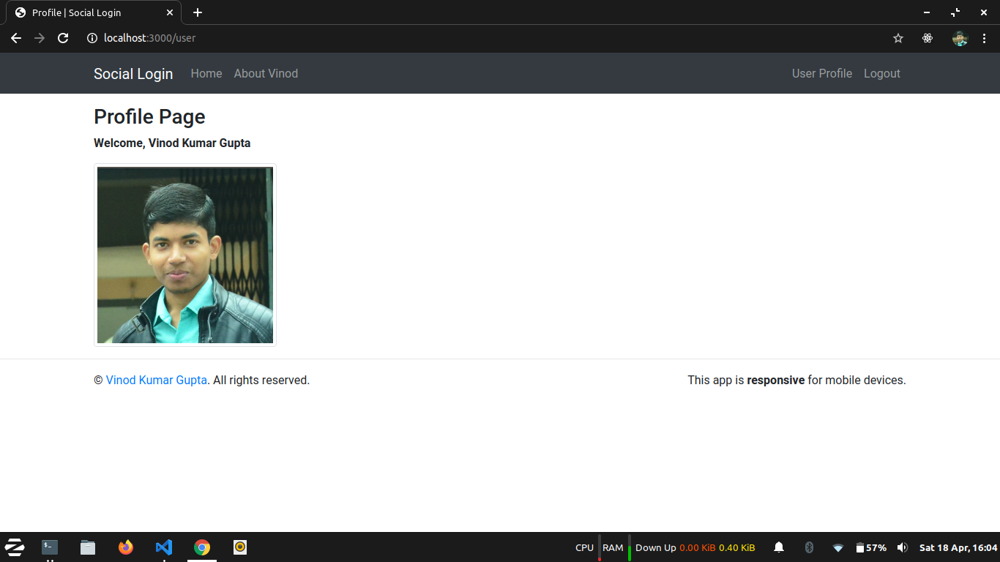

# Social Login

This app is demonstration of user authentication using Google+ API. This repository is submitted to complete the assignment asked by Kloudspot Inc.

Link to LinkedIn profile of [Vinod Kumar Gupta](https://linkedin.com/in/vkgupta857)

***Please find the license at the end of file.***

## Requirements for running the app

 - Node.js (v12.16)
 - MongoDB (v3.6)
 - Nodemon

## Instructions to run the app

 - Extract the zip file
 - Go to extracted folder
 - Install dependencies using `npm install`
 - Run the app using `npm start`

## Technology Stack

 - MongoDB (v3.6)
 - Express Framework (v4.6)
 - Node.js (v12.16)
 - EJS (Embedded JavaScript)
 - Bootstrap 4.4
 - Passport.js
 - Google+ API (OAuth 2.0)

## Snapshots

### Home Page (Desktop)

### Home Page (Mobile)

### Profile Page (Desktop)

### About Page (Desktop)

## License

This repository is developed and owned by [Vinod Kumar Gupta](https://github.com/vkgupta857). No license is granted to use any part of the application without consent. To use any part of the application, you need to ask for permission from the owner through [Email](mailto:vkgupta857@gmail.com).